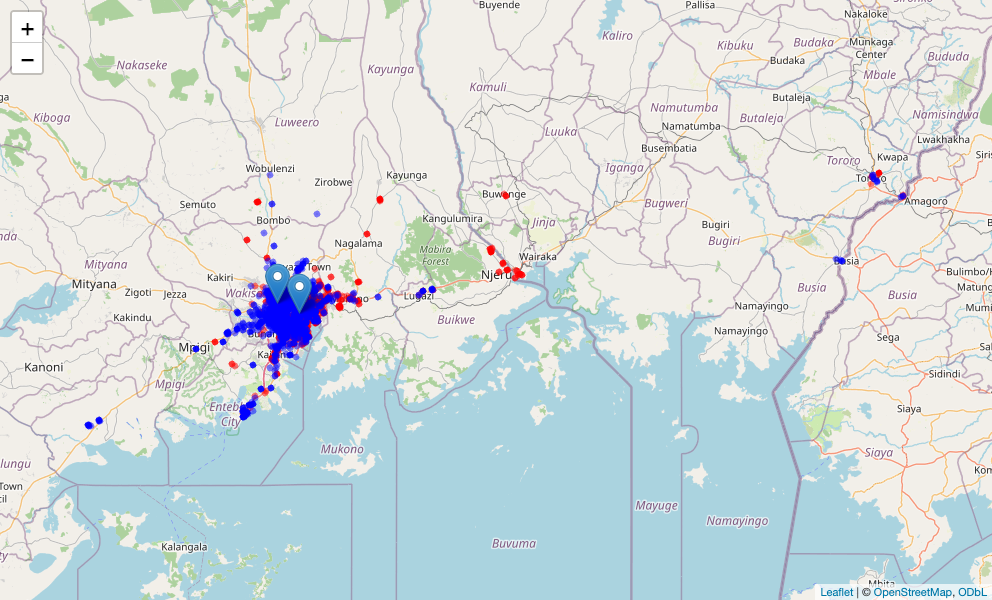

<!-- README.md is generated from README.Rmd. Please edit that file -->

```{r, include = FALSE}
knitr::opts_chunk$set(
  collapse = TRUE,
  comment = "#>",
  fig.path = "man/figures/README-",
  out.width = "100%",
  message = FALSE,
  warning = FALSE,
  fig.retina = 2,
  fig.align = 'center'
)
```

# fslogisticskampala

<!-- badges: start -->

[](https://creativecommons.org/licenses/by/4.0/)
[](https://github.com/openwashdata/fslogisticskampala/actions/workflows/R-CMD-check.yaml)
<!-- badges: end -->

The goal of fslogisticskampala is to provide data sources on faecal sludge transporting logistics in Kampala, Uganda collected from 30th March 2015 until 25th June 2015. 

## Installation

You can install the development version of fslogisticskampala from
[GitHub](https://github.com/) with:

``` r
# install.packages("devtools")
devtools::install_github("openwashdata/fslogisticskampala")
```

```{r}
## Run the following code in console if you don't have the packages
## install.packages(c("dplyr", "knitr", "readr", "stringr", "gt", "kableExtra", "leaflet"))
library(dplyr)
library(knitr)
library(readr)
library(stringr)
library(gt)
library(kableExtra)
library(leaflet)
```

Alternatively, you can download the individual datasets as a CSV or XLSX
file from the table below.

```{r, echo=FALSE, message=FALSE, warning=FALSE}

extdata_path <- "https://github.com/openwashdata/fslogisticskampala/raw/main/inst/extdata/"

read_csv("data-raw/dictionary.csv") |> 
  distinct(file_name) |> 
  dplyr::mutate(file_name = str_remove(file_name, ".rda")) |> 
  dplyr::rename(dataset = file_name) |> 
  mutate(
    CSV = paste0("[Download CSV](", extdata_path, dataset, ".csv)"),
    XLSX = paste0("[Download XLSX](", extdata_path, dataset, ".xlsx)")
  ) |> 
  knitr::kable()

```

## Data

The package provides access to two datasets `trips` and `trucks`. 

```{r}
library(fslogisticskampala)
```

### trips

The dataset `trips` contains data about the GPS locations of faecal sludge trucks collecting sludge from pit latrines and septic tanks in Kampala, Uganda. Each trip is recorded with a unique identifier, the numberplate of the truck, the date and time of the record. Data was collected from 30th March 2015 until 25th June 2015.
It has `r nrow(trips)` observations and `r ncol(trips)` variables

```{r}
trips |> 
  head(3) |> 
  gt::gt() |>
  gt::as_raw_html()
```

For an overview of the variable names, see the following table.

```{r echo=FALSE, message=FALSE, warning=FALSE}
readr::read_csv("data-raw/dictionary.csv") |>
  dplyr::filter(file_name == "trips.rda") |>
  dplyr::select(variable_name:description) |> 
  knitr::kable() |> 
  kableExtra::kable_styling("striped") |> 
  kableExtra::scroll_box(height = "200px")
```

### trucks

The dataset `trucks` contains data about additional information on the volume of each truck used in the dataset `trips`.
It has `r nrow(trucks)` observations and `r ncol(trucks)` variables

```{r}
trucks |> 
  head(3) |> 
  gt::gt() |>
  gt::as_raw_html()
```

For an overview of the variable names, see the following table.

```{r echo=FALSE, message=FALSE, warning=FALSE}
readr::read_csv("data-raw/dictionary.csv") |>
  dplyr::filter(file_name == "trucks.rda") |>
  dplyr::select(variable_name:description) |> 
  knitr::kable() |> 
  kableExtra::kable_styling("striped") |> 
  kableExtra::scroll_box(height = "200px")
```

## Example 1
A plot showing the collection locations of the truck with number plate "AUS 119X"
```{r}
library(fslogisticskampala)
library(ggplot2)
library(lubridate)

aus <- trips |>
  dplyr::filter(numberplate == "AUS 119X") |>
  dplyr::filter(date < ymd("2015-04-06"))

ggplot(aus, aes(x = lon, y = lat, color = date)) +
  geom_point() +
  labs(title = "GPS Locations of Faecal Sludge Trucks",
       x = "Longitude",
       y = "Latitude",
       color = "Treatment Plant") +
  theme_minimal()
```

## Example 2

A map of all collection points (red) and the existing treatment plants.
The code below builds an interactive `leaflet` map. On the package website
the map is interactive; in this README it is shown as a static screenshot,
because GitHub does not render JavaScript widgets in Markdown.

```{r}
map <- leaflet(data = trips) |>
  addTiles() |>
  addCircleMarkers(
    ~lon, ~lat,
    popup = ~as.character(plant),
    color = ~ifelse(plant == "Bugolobi", "red", "blue"),
    radius = 0.5
  ) |>
  addMarkers(
    lng = ~c(32.6071673, 32.5458844),
    lat = ~c(0.3190139, 0.3472747),
    popup = ~c("Bugolobi FS treatment plant", "Lubigi FS treatment plant")
  )
```

```{r map-screenshot, echo=FALSE, message=FALSE, warning=FALSE, results='hide'}
# Render a static screenshot of the interactive map for the GitHub README.
html_file <- tempfile(fileext = ".html")
png_file <- "man/figures/README-map-collection-locations.png"
htmlwidgets::saveWidget(map, html_file, selfcontained = TRUE)
invisible(webshot2::webshot(html_file, file = png_file, vwidth = 992, vheight = 600, delay = 2))
```



## License

Data are available as
[CC-BY](https://github.com/openwashdata/fslogisticskampala/blob/main/LICENSE.md).

## Citation

Please cite this package using:

```{r}
citation("fslogisticskampala")
```
