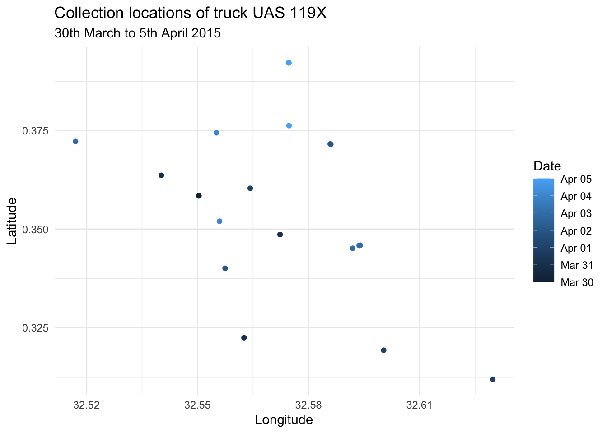

# fslogisticskampala

The goal of fslogisticskampala is to provide data on faecal sludge
transporting logistics in Kampala, Uganda. The package contains two
datasets: `trips` records the GPS locations of emptying trucks
collecting sludge from pit latrines and septic tanks, and `trucks`
records the volume of each truck. The records cover the period from 30th
March 2015 until 25th June 2015. The raw data was published as
supplementary material of an open-access article in the journal
Sustainability (MDPI).

## Installation

You can install the development version of fslogisticskampala from
[GitHub](https://github.com/) with:

``` r

# install.packages("devtools")
devtools::install_github("openwashdata/fslogisticskampala")
```

``` r

## Run the following code in console if you don't have the packages
## install.packages(c("dplyr", "knitr", "readr", "stringr", "gt", "kableExtra", "leaflet"))
library(dplyr)
library(knitr)
library(readr)
library(stringr)
library(gt)
library(kableExtra)
library(leaflet)
```

Alternatively, you can download the individual datasets as a CSV or XLSX
file from the table below.

| dataset | CSV | XLSX |
|:---|:---|:---|
| trips | [Download CSV](https://github.com/openwashdata/fslogisticskampala/raw/main/inst/extdata/trips.csv) | [Download XLSX](https://github.com/openwashdata/fslogisticskampala/raw/main/inst/extdata/trips.xlsx) |
| trucks | [Download CSV](https://github.com/openwashdata/fslogisticskampala/raw/main/inst/extdata/trucks.csv) | [Download XLSX](https://github.com/openwashdata/fslogisticskampala/raw/main/inst/extdata/trucks.xlsx) |

## Data

The package provides access to two datasets `trips` and `trucks`.

``` r

library(fslogisticskampala)
```

### trips

The dataset `trips` contains data about the GPS locations of faecal
sludge trucks collecting sludge from pit latrines and septic tanks in
Kampala, Uganda. Each trip is recorded with a unique identifier, the
numberplate of the truck, the date and time of the record. Data was
collected from 30th March 2015 until 25th June 2015. It has 5653
observations and 7 variables

``` r

trips |> 
  head(3) |> 
  gt::gt() |>
  gt::as_raw_html()
```

| fid | numberplate |       date |   time   |      lat |      lon | plant    |
|----:|:------------|-----------:|:--------:|---------:|---------:|:---------|
| 117 | UAS 119X    | 2015-03-30 | 10:53:03 | 0.358437 | 32.55036 | Bugolobi |
| 118 | UAS 119X    | 2015-03-31 | 03:53:41 | 0.348626 | 32.57229 | Bugolobi |
| 119 | UAS 119X    | 2015-03-31 | 10:33:01 | 0.322447 | 32.56255 | Bugolobi |

For an overview of the variable names, see the following table.

| variable_name | variable_type | description |
|:---|:---|:---|
| fid | integer | Running ID for each recorded GPS location of a truck. |
| numberplate | character | Numberplate of the truck, can be joined with `trucks` resource. |
| date | Date | Date of the record in ISO 8601 format. |
| time | c(“hms”, “difftime”) | Time of the record in hours, minutes, seconds. |
| lat | numeric | Latitude of the record. |
| lon | numeric | Longitude of the record. |
| plant | character | Treatment plant that the truck delivered faecal sludge to. |

### trucks

The dataset `trucks` contains data about additional information on the
volume of each truck used in the dataset `trips`. It has 33 observations
and 2 variables

``` r

trucks |> 
  head(3) |> 
  gt::gt() |>
  gt::as_raw_html()
```

| numberplate | volume |
|:------------|-------:|
| UAS 119X    |    3.0 |
| UAG 448X    |    3.5 |
| UAN 030N    |    3.0 |

For an overview of the variable names, see the following table.

| variable_name | variable_type | description |
|:---|:---|:---|
| numberplate | character | Numberplate of the truck, can be joined with `trips` resource. |
| volume | numeric | Volume of the truck in cubic meters. |

## Example 1

The figure below (chunk `plot-collection-locations`) shows the
collection locations of the truck with number plate “UAS 119X” during
the first week of data collection, coloured by collection date.

``` r

library(fslogisticskampala)
library(ggplot2)
library(lubridate)

uas <- trips |>
  dplyr::filter(numberplate == "UAS 119X") |>
  dplyr::filter(date < ymd("2015-04-06"))

ggplot(uas, aes(x = lon, y = lat, color = date)) +
  geom_point() +
  labs(title = "Collection locations of truck UAS 119X",
       subtitle = "30th March to 5th April 2015",
       x = "Longitude",
       y = "Latitude",
       color = "Date") +
  theme_minimal()
```



## Example 2

The map below (chunks `build-map` and `map-screenshot`) shows all
collection points, coloured red for Bugolobi and blue for Lubigi,
together with markers for the two treatment plants. It is shown as a
static image, because GitHub does not render interactive JavaScript
widgets in Markdown. For the fully interactive version (pan, zoom,
click), see the article [Interactive map of collection
locations](https://openwashdata.github.io/fslogisticskampala/articles/collection-locations-map.html)
on the package website.

``` r

map <- leaflet(data = trips) |>
  addTiles() |>
  addCircleMarkers(
    ~lon, ~lat,
    popup = ~as.character(plant),
    color = ~ifelse(plant == "Bugolobi", "red", "blue"),
    radius = 0.5
  ) |>
  addMarkers(
    lng = ~c(32.6071673, 32.5458844),
    lat = ~c(0.3190139, 0.3472747),
    popup = ~c("Bugolobi FS treatment plant", "Lubigi FS treatment plant")
  )
```


Map with collection locations and the existing treatment plants

The interactive map was contributed by Jos van der Ent as part of a
[capstone project](https://github.com/ds4owd-002/project-yozgoesdigital)
for the Data Science for Open WASH Data course.

## License

Data are available as
[CC-BY](https://github.com/openwashdata/fslogisticskampala/blob/main/LICENSE.md).

## Citation

Please cite this package using:

``` r

citation("fslogisticskampala")
#> To cite package 'fslogisticskampala' in publications use:
#> 
#>   Schöbitz L (2026). "fslogisticskampala: Data on Faecal Sludge
#>   Transporting Logistics in Kampala, Uganda."
#>   doi:10.5281/zenodo.21260446
#>   <https://doi.org/10.5281/zenodo.21260446>.
#>   <https://github.com/openwashdata/fslogisticskampala>.
#> 
#> A BibTeX entry for LaTeX users is
#> 
#>   @Misc{schobitz:2026,
#>     title = {fslogisticskampala: Data on Faecal Sludge Transporting Logistics in Kampala, Uganda},
#>     author = {Lars Schöbitz},
#>     year = {2026},
#>     doi = {10.5281/zenodo.21260446},
#>     url = {https://github.com/openwashdata/fslogisticskampala},
#>     abstract = {Contains two data resources. `trips` contains the GPS locations of faecal sludge emptying trucks collecting sludge from pit latrines and septic tanks in Kampala, Uganda. Each trip is recorded with a unique identifier, the numberplate of the truck, the date and time of the record. Data was collected from 30th March 2015 until 25th June 2015. `trucks` has additional information on the volume of each truck.},
#>     version = {1.0.0},
#>   }
```
